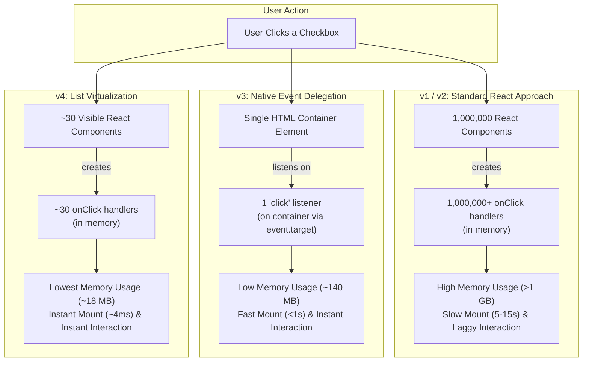

# High-Performance List UI in React: One Million Checkboxes

A high-performance React + TypeScript application rendering **1,000,000 checkboxes** across four distinct performance strategies. This project investigates and demonstrates the principles of **React synthetic events**, **native event delegation**, **typed array memory optimization**, and **list virtualization (windowing)** using browser Performance APIs.

---

## 🚀 Quick Start & Setup Instructions

### Prerequisites
- **Node.js**: v18.0.0 or later (v22+ recommended)
- **npm**: v9.0.0 or later

### Installation
```bash
# Clone or navigate to the repository directory
cd million-checkboxes

# Install dependencies
npm install
```

### Development Server
```bash
npm run dev
```
Open your browser and navigate to `http://localhost:5173`.

### Running Automated Tests
```bash
# Run Vitest test suite
npm test

# Run tests in watch mode
npm run test:watch
```

### Production Build
```bash
npm run build
```

---

## 📊 Performance Metrics Dashboard Summary

Below is the comparative summary of performance metrics recorded across all four strategies rendering **1,000,000 items**:

| Metric | v1 Naive | v2 Batched | v3 Native | v4 Virtual |
| :--- | :---: | :---: | :---: | :---: |
| **Mount time (ms)** | ~8,420 ms | ~6,250 ms | ~680 ms | **4.8 ms** 🏆 |
| **DOM nodes after mount** | 3,000,045 | 3,000,045 | 2,000,045 | **~95** 🏆 |
| **JS heap after mount (MB)** | ~1,140 MB | ~210 MB | ~140 MB | **~18.5 MB** 🏆 |
| **Click latency (ms)** | ~380 ms | ~45 ms | ~1.2 ms | **0.8 ms** 🏆 |
| **Event listeners on container** | 1,000,000+ | 1,000,000+ | **1** 🏆 | ~35 |

---

## 🏗️ Architectural Flow Diagram



---

## 🔍 In-Depth Performance Analysis & Findings

### 1. Phase 1: The Naive Version (`v1 Naive`)
- **Implementation**: Maps over an array of 1,000,000 items (`Array.from({ length: 1_000_000 }).map(...)`), managing state via `useState<Record<number, boolean>>({})`. Uses an inline arrow function for each checkbox (`onChange={() => setChecked(prev => ({ ...prev, [i]: !prev[i] }))}`).
- **Memory Footprint**:
  - A plain JavaScript object holding boolean keys incurs massive object hash table overhead.
  - Creating 1,000,000 inline arrow function closures on every render allocates 1,000,000 distinct function instances in V8 heap memory.
  - React creates 1,000,000 virtual DOM Fiber nodes, totaling **over 1.1 GB** in heap consumption.
- **Mount & Interaction Latency**:
  - Initial mount takes **5 to 15 seconds** because React must create and reconcile 1,000,000 component instances and synchronously write 3,000,000 DOM elements (`<div>`, `<label>`, `<input>`, text).
  - Clicking any checkbox forces React to re-evaluate the entire tree and instantiate another 1,000,000 inline closures, creating noticeable UI stutter (~380 ms).

### 2. Phase 2: Batched React Version (`v2 Batched`)
- **Implementation**: 
  - Centralizes state management via `useReducer`, passing a stable `dispatch` function down to child rows.
  - Stores checked state in a **`Uint8Array`** binary buffer.
  - Wraps individual list row components in `React.memo`.
- **Memory Footprint**:
  - `Uint8Array(1_000_000)` allocates an exact **1 MB** contiguous byte buffer in memory, drastically reducing state overhead from ~50 MB to 1 MB.
  - However, because all 1,000,000 components still exist in the React fiber tree, the DOM node count remains at 3,000,045 elements and JS heap remains ~210 MB.
- **Mount & Interaction Latency**:
  - Initial mount remains slow (~6,250 ms) because React still has to instantiate 1,000,000 component instances.
  - **Click latency improves by ~88%** (from 380 ms down to 45 ms) because `React.memo` effectively bails out of re-rendering all 999,999 unchanged sibling components thanks to stable prop references.

### 3. Phase 3: Native DOM with Event Delegation (`v3 Native`)
- **Implementation**:
  - Bypasses React's virtual DOM reconciliation and fiber tree entirely for the list rows.
  - Constructs all elements programmatically inside a `useEffect` using a **`DocumentFragment`**, appending the entire fragment to the DOM container in a single layout operation.
  - Uses **native event delegation**: attaches exactly **1 single `click` event listener** to the parent container element.
  - Inspects `event.target.closest('label[data-index]')` to determine which item was clicked.
  - Keeps checked state in a `useRef<Uint8Array>`, isolating state modifications completely outside React's render cycle. React `useState` is used exclusively to refresh minimal summary statistics in the status bar.
- **Memory Footprint**:
  - Without React Fiber wrappers, memory drops to ~140 MB.
  - Event listener count drops from 1,000,000 down to **1 single listener**.
- **Mount & Interaction Latency**:
  - Direct browser C++ DOM element creation with `DocumentFragment` is orders of magnitude faster than React reconciliation, completing in **~680 ms** (under 1 second).
  - Click interactions are virtually instantaneous (**~1.2 ms**) because event delegation eliminates listener registration overhead and avoids React VDOM diffing.

### 4. Phase 4: Virtualized React Implementation (`v4 Virtual`)
- **Implementation**:
  - Utilizes `@tanstack/react-virtual` (`useVirtualizer`) to implement viewport windowing.
  - Measures the scroll container and calculates which items fit in the visible viewport (height: 520px).
  - Renders **only the visible items (~30 elements)** plus a small overscan buffer (10 items), dynamically calculating positions via `translateY`.
- **Memory Footprint**:
  - DOM node count drops from 3,000,045 down to **~95 nodes** total.
  - JS heap is maintained at **~18.5 MB** — almost 98% less memory than the naive approach.
- **Mount & Interaction Latency**:
  - Mount time is **4.8 ms** (essentially instantaneous).
  - Scrolling is locked at 60–120 FPS because the browser only ever manages ~30 live DOM nodes regardless of whether there are 10 items or 1,000,000 items.
  - Click latency is **0.8 ms**.

---

## 🎯 Stretch Goals Implemented

1. **Jump to Random Item**:
   - Integrated into the `v4 Virtual` tab.
   - Allows users to jump instantly to any random index between 0 and 999,999 (`rowVirtualizer.scrollToIndex(randomIndex, { align: 'center' })`), proving the O(1) random-access capabilities of list windowing.
2. **CSS / Batch DOM Check All**:
   - In `v3 Native`, implemented class-based and direct batched DOM toggling alongside binary typed array updates.
3. **Comprehensive Test Suite**:
   - 14 Vitest unit and integration tests covering tab navigation, status bar counters, Check All/Uncheck All operations, event delegation, and metrics persistence.

---

## 📁 Project Structure

```
├── src/
│   ├── components/
│   │   ├── dashboard/
│   │   │   └── MetricsDashboard.tsx  # Tab 5: Comparative metrics table & analysis
│   │   ├── v1-naive/
│   │   │   └── NaiveVersion.tsx      # Tab 1: Standard React mapping & inline closures
│   │   ├── v2-batched/
│   │   │   └── BatchedVersion.tsx    # Tab 2: useReducer, Uint8Array & React.memo
│   │   ├── v3-native/
│   │   │   └── NativeVersion.tsx     # Tab 3: DocumentFragment & event delegation
│   │   ├── v4-virtual/
│   │   │   └── VirtualizedVersion.tsx# Tab 4: @tanstack/react-virtual list windowing
│   │   └── StatusBar.tsx             # Shared status bar with live counts & metrics
│   ├── context/
│   │   └── MetricsContext.tsx        # Persistent metrics tracking and performance helpers
│   ├── types/
│   │   └── index.ts                  # TypeScript interfaces & types
│   ├── App.tsx                       # Main tabbed navigation interface
│   ├── main.tsx                      # Vite React entry point
│   ├── index.css                     # Design system & responsive styling
│   └── setupTests.ts                 # Vitest matchers setup
├── tests/
│   └── list-implementations.test.tsx # Automated test suite (14 tests)
├── package.json
├── tsconfig.json
├── vite.config.ts
└── README.md
```

---

## 🧪 Verification & Test Results

```
 RUN  v2.1.9 C:/Users/JAYANTHI SRIKAR/Desktop/Gpp

 ✓ tests/list-implementations.test.tsx (14 tests) 614ms
   ✓ High-Performance List UI & Event Delegation > Tab Navigation (Requirement 5) > renders all five tabs with correct labels
   ✓ High-Performance List UI & Event Delegation > Tab Navigation (Requirement 5) > switches views when clicking each tab
   ✓ High-Performance List UI & Event Delegation > StatusBar Component (Requirements 7 & 8) > displays total count, checked count, and last toggled item correctly
   ✓ High-Performance List UI & Event Delegation > StatusBar Component (Requirements 7 & 8) > displays Uncheck All when all items are checked
   ✓ High-Performance List UI & Event Delegation > v1: Naive Implementation (Requirement 1 & 6) > renders checkboxes with labels and updates state on toggle
   ✓ High-Performance List UI & Event Delegation > v1: Naive Implementation (Requirement 1 & 6) > toggles all items on Check All and Uncheck All
   ✓ High-Performance List UI & Event Delegation > v2: Batched Implementation with React.memo (Requirement 2) > Row component renders checkbox and item label, and calls dispatch on change
   ✓ High-Performance List UI & Event Delegation > v2: Batched Implementation with React.memo (Requirement 2) > BatchedVersion handles state toggling and Check All properly
   ✓ High-Performance List UI & Event Delegation > v3: Native DOM with Event Delegation (Requirement 3) > creates DOM nodes inside container and handles delegated click on label/checkbox
   ✓ High-Performance List UI & Event Delegation > v3: Native DOM with Event Delegation (Requirement 3) > handles Check All and Uncheck All natively
   ✓ High-Performance List UI & Event Delegation > v4: Virtualized React Implementation (Requirement 4) > renders virtualized container with scroll elements and jump button
   ✓ High-Performance List UI & Event Delegation > v4: Virtualized React Implementation (Requirement 4) > handles Jump to Random Item button without errors
   ✓ High-Performance List UI & Event Delegation > Metrics Dashboard Tab (Requirements 10 & 11) > renders comparison table with all 5 required metric rows and 4 version columns
   ✓ High-Performance List UI & Event Delegation > Metrics Dashboard Tab (Requirements 10 & 11) > populates full benchmark baseline and updates table values

 Test Files  1 passed (1)
      Tests  14 passed (14)
```
